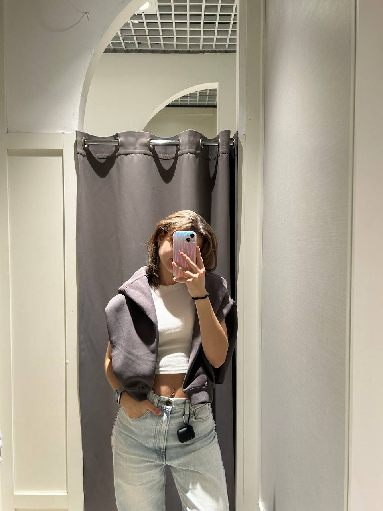

<!DOCTYPE html>
<html lang="ru">
<head>
    <meta charset="UTF-8">
    <meta name="viewport" content="width=device-width, initial-scale=1.0">
    <title>Ангелина - директор зоомагазина</title>
    <!-- Подключаем jQuery -->
    
    
</head>
<body>
    <!-- Навигационное меню -->
    <nav>
        

            <a href="#home" class="logo">ЗооМир</a>
            
            

                

                

                

            

            
            <ul class="nav-menu" id="navMenu">
                <li class="nav-item"><a href="#home" class="nav-link">Главная</a></li>
                <li class="nav-item"><a href="#achievements" class="nav-link">Достижения</a></li>
                <li class="nav-item"><a href="#products" class="nav-link">Товары и услуги</a></li>
                <li class="nav-item"><a href="#contact" class="nav-link">Обратная связь</a></li>
            </ul>
        

    </nav>

    

    
    <section class="hero-section" id="home">
        

            <h1>Эксперт в заботе о ваших питомцах!</h1>
            <h2>Мы помогаем создать дом, полный любви и заботы для вашего пушистого друга. От первого поводка до любимой игрушки — мы рядом на каждом этапе жизни вашего питомца.</h2>
            
Ленивец - тотем нашего директора.

            <button class="cta-button" id="contactBtn">Связаться со мной</button>
        

        

            
            

                
            

        

    </section>

    <!-- ОБЩИЙ КОНТЕЙНЕР ДЛЯ ВСЕХ СЕКЦИЙ -->
    

        <!-- Секция достижений -->
        <section class="achievements-section" id="achievements">
            <h2 class="section-title">Наши Достижения</h2>
            

                

                    
🎯

                    <h3 class="achievement-title">Более 10 000 довольных хвостатых клиентов</h3>
                    
С 2018 года мы помогли обустроить комфортную жизнь для 10 000+ питомцев. Каждая вторая покупка — по рекомендации довольных клиентов!

                

                

                    
👨‍⚕️

                    <h3 class="achievement-title">Эксперты с ветеринарным образованием</h3>
                    
Наши консультанты — специалисты с ветеринарным образованием. Бесплатно помогаем подобрать оптимальный рацион и уход именно для вашего питомца.

                

                

                    
⭐

                    <h3 class="achievement-title">95% товаров — премиум-качество</h3>
                    
Мы тщательно тестируем ассортимент: 95% товаров в нашем магазине имеют сертификаты качества и одобрены ветеринарами.

                

                

                    
🤝

                    <h3 class="achievement-title">Партнерство с приютами для животных</h3>
                    
Ежемесячно помогаем местным приютам: передаем корм, лекарства и аксессуары. Уже подарили вторую жизнь 500+ бездомным животным.

                

                

                    
👑

                    <h3 class="achievement-title">Собственная линия гипоаллергенных кормов</h3>
                    
Разработали эксклюзивную линейку кормов для питомцев с особенностями здоровья. У 98% животных отметили улучшение состояния.

                

                

                    
🏅

                    <h3 class="achievement-title">Лучший зоомагазин города 2023-2024</h3>
                    
По оценкам покупателей стали лучшим зоомагазином города два года подряд. Ваша любовь — наша главная награда!

                

            

        </section>

        <!-- Секция товаров и услуг -->
        <section class="products-section" id="products">
            <h2 class="section-title">Наши товары и услуги</h2>
            

                <!-- Товар 1: Корма -->
                

                    Товар
                    

                        
🍖

                        

                            <h3 class="product-title">Качественные корма</h3>
                            Питание
                        

                    

                    
Широкий ассортимент кормов премиум-класса для собак, кошек, грызунов, птиц и экзотических животных от ведущих мировых производителей.

                    

                        Сухие корма
                        Влажные корма
                        Лечебные диеты
                        Натуральные лакомства
                    

                    

                        <!-- ИЗМЕНЁННАЯ СТРУКТУРА ЦЕНЫ - теперь "от 15" -->
                        
от 15

                        <a href="#contact" class="product-action">Заказать</a>
                    

                

                <!-- Товар 2: Аксессуары -->
                

                    Товар
                    

                        
🐕

                        

                            <h3 class="product-title">Аксессуары и игрушки</h3>
                            Аксессуары
                        

                    

                    
Все необходимое для комфорта вашего питомца: ошейники, поводки, миски, лежанки, переноски и развивающие игрушки.

                    

                        Ошейники
                        Миски и поилки
                        Лежанки
                        Интерактивные игрушки
                    

                    

                        <!-- ИЗМЕНЁННАЯ СТРУКТУРА ЦЕНЫ - теперь "от 10" -->
                        
от 10

                        <a href="#contact" class="product-action">Заказать</a>
                    

                

                <!-- Товар 3: Средства ухода -->
                

                    Товар
                    

                        
✨

                        

                            <h3 class="product-title">Средства по уходу</h3>
                            Гигиена
                        

                    

                    
Профессиональная косметика и средства гигиены для поддержания здоровья и красоты вашего питомца.

                    

                        Шампуни
                        Расчески
                        Средства от паразитов
                        Гигиеническая косметика
                    

                    

                        <!-- ИЗМЕНЁННАЯ СТРУКТУРА ЦЕНЫ - теперь "от 10" -->
                        
от 10

                        <a href="#contact" class="product-action">Заказать</a>
                    

                

                <!-- Услуга 1: Консультации -->
                

                    Услуга
                    

                        
👨‍⚕️

                        

                            <h3 class="product-title">Ветеринарные консультации</h3>
                            Консультация
                        

                    

                    
Бесплатные консультации от наших специалистов с ветеринарным образованием по подбору корма и уходу за питомцем.

                    

                        Подбор рациона
                        Рекомендации по уходу
                        Первая помощь
                        Профилактика заболеваний
                    

                    

                        <!-- Для бесплатных услуг используем класс free -->
                        
Бесплатно

                        <a href="#contact" class="product-action">Записаться</a>
                    

                

                <!-- Услуга 2: Груминг -->
                

                    Услуга
                    

                        
✂️

                        

                            <h3 class="product-title">Услуги груминга</h3>
                            Уход
                        

                    

                    
Профессиональный уход за шерстью, стрижка, мытье и другие процедуры для поддержания опрятного вида вашего питомца.

                    

                        Стрижка
                        Мытье и сушка
                        Чистка ушей
                        Стрижка когтей
                    

                    

                        <!-- ИЗМЕНЁННАЯ СТРУКТУРА ЦЕНЫ - теперь "от 30" -->
                        
от 30

                        <a href="#contact" class="product-action">Записаться</a>
                    

                

                <!-- Услуга 3: Дрессировка -->
                

                    Услуга
                    

                        
🎓

                        

                            <h3 class="product-title">Курсы дрессировки</h3>
                            Обучение
                        

                    

                    
Обучение собак основным командам, коррекция поведения и социализация под руководством опытных кинологов.

                    

                        Базовые команды
                        Коррекция поведения
                        Социализация
                        Специальные курсы
                    

                    

                        <!-- ИЗМЕНЁННАЯ СТРУКТУРА ЦЕНЫ - теперь "от 55" -->
                        
от 55

                        <a href="#contact" class="product-action">Записаться</a>
                    

                

            

        </section>

        <!-- Секция обратной связи с Getform.io -->
        <section class="contact-section" id="contact">
            <h2 class="section-title">Обратная связь</h2>
            
            

                <!-- Сообщения об успехе/ошибке -->
                

                
                <!-- Индикатор загрузки -->
                

                    

                    
Отправка формы...

                

                
                <!-- Форма Getform.io -->
                <!-- ВАЖНО: Замените YOUR_FORM_ID на ваш реальный ID из Getform.io -->
                <form id="feedbackForm" action="https://getform.io/f/bejvrvla" method="POST">
                    <!-- Скрытое поле для указания формы -->
                    <input type="hidden" name="form_name" value="Форма обратной связи с сайта ЗооМир">
                    
                    

                        <label for="name">Ваше имя *</label>
                        <input type="text" id="name" name="name" placeholder="Введите ваше имя" required>
                    

                    
                    

                        <label for="email">Ваш email *</label>
                        <input type="email" id="email" name="email" placeholder="Введите ваш email" required>
                    

                    
                    

                        <label for="phone">Ваш телефон</label>
                        <input type="tel" id="phone" name="phone" placeholder="+375 (XX) XXX-XX-XX">
                    

                    
                    

                        <label for="interest">Меня интересует:</label>
                        <select id="interest" name="interest">
                            <option value="">Выберите вариант</option>
                            <option value="product">Покупка товаров</option>
                            <option value="service">Заказ услуг</option>
                            <option value="consultation">Консультация специалиста</option>
                            <option value="partnership">Сотрудничество</option>
                            <option value="other">Другое</option>
                        </select>
                    

                    
                    

                        <label for="budget">Бюджет (BYN):</label>
                        <select id="budget" name="budget">
                            <option value="">Не указано</option>
                            <option value="0-50">до 50 BYN</option>
                            <option value="50-100">50-100 BYN</option>
                            <option value="100-200">100-200 BYN</option>
                            <option value="200-500">200-500 BYN</option>
                            <option value="500+">более 500 BYN</option>
                        </select>
                    

                    
                    

                        <label for="message">Ваше сообщение *</label>
                        <textarea id="message" name="message" placeholder="Опишите ваш вопрос или пожелание..." required></textarea>
                    

                    
                    

                        <label class="checkbox-container">
                            <input type="checkbox" name="newsletter" checked>
                            Я согласен получать новости и специальные предложения
                        </label>
                    

                    
                    <button type="submit" class="cta-button" id="submitBtn">Отправить сообщение</button>
                </form>
            

        </section>
    

    <!-- Футер -->
    

    <!-- Отступ в самом низу страницы -->
    

    
</body>
</html>
